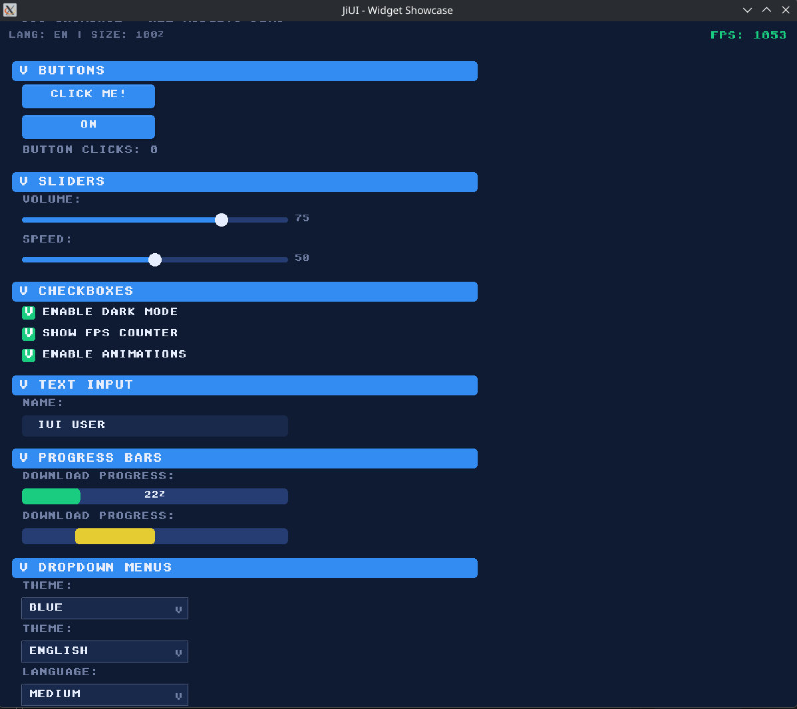
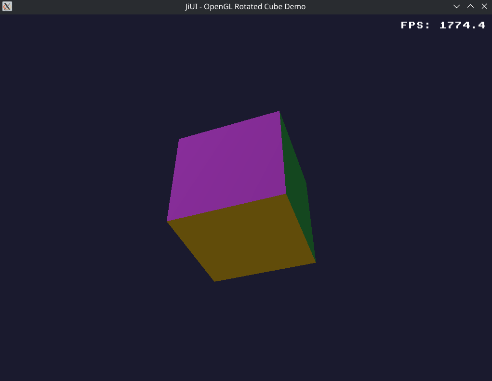
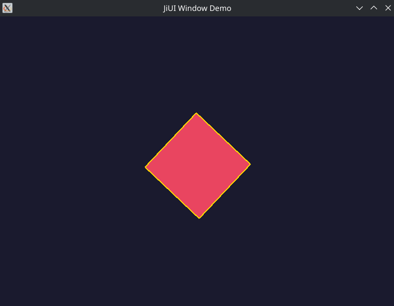

# JiUI — Declarative UI Framework for C/C++

[](https://github.com/Ali-A-2026/JiUI/actions)
[](LICENSE)
[](CHANGELOG.md)
[](tests/)
[](https://en.cppreference.com/w/c/11)
[](#-zero-dependencies)

<p align="center">
  
</p>

> **JiUI** — A complete, Declarative UI framework written in pure C with C++ bindings.
> **Zero external dependencies.** Cross-platform. 40+ widgets. CSS stylesheets. Docking. Animation. Effects.
> GPU rendering. 3D viewport. Multimedia. Threading. i18n. Accessibility. Plugin system. And much more.

---

## ✨ Feature Comparison

| Feature | JiUI | Qt6 | GTK4 | Avalonia | Dear ImGui | Flutter | Electron |
|---------|------|-----|------|----------|------------|----------|-----------|
| Language | C11 + C++17 | C++17 | C | C# | C++ | Dart | JS/TS |
| **Zero Dependencies** | ✅ | ❌ | ❌ | ❌ | ✅ | ❌ | ❌ |
| CSS Stylesheets | ✅ | ✅ | ✅ | ❌ | ❌ | ❌ | ✅ |
| Live Style Reload | ✅ | ❌ | ❌ | ❌ | ❌ | ✅ | ✅ |
| Docking System | ✅ | ✅ | ❌ | ❌ | ✅ | ❌ | ❌ |
| Animation Engine | ✅ | ✅ | ❌ | ✅ | ❌ | ✅ | ✅ |
| Spring Physics | ✅ | ❌ | ❌ | ❌ | ❌ | ✅ | ✅ |
| Virtual Scrolling | ✅ | ✅ | ✅ | ✅ | ✅ | ✅ | ✅ |
| Effect Chains | ✅ | ❌ | ❌ | ❌ | ❌ | ✅ | ✅ |
| Inner Shadows | ✅ | ❌ | ❌ | ❌ | ❌ | ✅ | ✅ |
| Glow Effects | ✅ | ❌ | ❌ | ❌ | ❌ | ✅ | ✅ |
| Undo/Redo Framework | ✅ | ✅ | ❌ | ❌ | ❌ | ❌ | ❌ |
| Model/View | ✅ | ✅ | ✅ | ✅ | ❌ | ❌ | ❌ |
| Declarative Markup | ✅ (JIML) | ✅ (QML) | ✅ (XML) | ✅ (AXML) | ❌ | ❌ | ✅ (HTML) |
| Code Generator | ✅ | ❌ | ❌ | ❌ | ❌ | ✅ | ❌ |
| GPU Backend Abstraction | ✅ | ✅ | ✅ | ✅ | ❌ | ✅ | ❌ |
| 3D Viewport | ✅ | ❌ | ❌ | ❌ | ❌ | ✅ | ✅ (WebGL) |
| Multimedia (Video/Audio) | ✅ | ✅ | ❌ | ❌ | ❌ | ❌ | ✅ |
| Multi-threaded Pipeline | ✅ | ❌ | ❌ | ❌ | ❌ | ✅ | ✅ |
| Plugin System | ✅ | ✅ | ✅ | ❌ | ❌ | ❌ | ❌ |
| Hot Reload | ✅ | ❌ | ❌ | ❌ | ✅ | ✅ | ✅ |
| i18n / RTL Support | ✅ | ✅ | ✅ | ✅ | ❌ | ✅ | ✅ |
| Accessibility (AT-SPI) | ✅ | ✅ | ✅ | ❌ | ❌ | ✅ | ✅ |
| Screenshot Testing | ✅ | ❌ | ❌ | ❌ | ❌ | ✅ | ❌ |
| Neural Network Inference | ✅ | ❌ | ❌ | ❌ | ❌ | ❌ | ❌ |
| Sandboxed Execution | ✅ | ❌ | ❌ | ❌ | ❌ | ❌ | ❌ |
| Automation / Replay | ✅ | ❌ | ❌ | ❌ | ❌ | ❌ | ❌ |
| HiDPI Support | ✅ | ✅ | ✅ | ✅ | ❌ | ✅ | ✅ |
| PBR Materials | ✅ | ❌ | ❌ | ❌ | ❌ | ✅ | ❌ |
| Frame Graph | ✅ | ✅ | ❌ | ❌ | ❌ | ✅ | ❌ |


## 🚀 Quick Start

```bash
git clone https://github.com/Ali-A-2026/JiUI.git
cd JiUI && mkdir build && cd build
cmake .. && make -j$(nproc) && ctest
```

```c
#include <jiui/jiui.h>

int main(void) {
    /* Initialize the JiUI library */
    JiResultCode result = ji_initialize();
    if (JI_FAILED(result))
        return 1;

    /* Create a resizable window with OpenGL context */
    JiWindow* win = ji_window_create("My App", 800, 600,
                                     JI_WINDOW_RESIZABLE | JI_WINDOW_OPENGL,
                                     NULL);
    if (!win) {
        ji_shutdown();
        return 1;
    }

    /* Run the event/render loop (blocks until window is closed) */
    ji_window_run(win);

    /* Cleanup */
    ji_window_destroy(win);
    ji_shutdown();
    return 0;
}
```

---

## 🎯 Zero Dependencies

JiUI has **zero external library dependencies**. Everything is built from scratch in pure C:

| What other frameworks need | What JiUI does |
|-----------------------------|----------------|
| zlib for PNG compression | Built-in DEFLATE stored-block encoder/decoder |
| libpng/libjpeg for image I/O | Built-in PNG reader/writer with CRC32 |
| ICU for internationalization | Built-in i18n with plural rules & BiDi |
| HarfBuzz for text shaping | Built-in text engine |
| AT-SPI2 for accessibility | Built-in AT-SPI bridge |
| External physics engine | Built-in spring physics solver |
| External neural network library | Built-in neural inference engine |

**System libraries used** (always available, not "dependencies"):
- `libm` (math) — part of every C runtime
- `libdl` (dynamic loading) — part of libc on Linux
- `libpthread` — part of libc on modern Linux
- OpenGL / X11 / Wayland — **optional** platform backends (disabled by default in CI)

---

## 📦 What's Included

### 40+ Widgets
| Category | Widgets |
|----------|---------|
| **Buttons** | Button, CheckBox, RadioButton, ToolButton, CommandLinkButton |
| **Containers** | GroupBox, Frame, ScrollArea, TabWidget, StackedWidget, ToolBar, StatusBar, Menu |
| **Inputs** | SpinBox, DoubleSpinBox, ComboBox, TextEdit, PlainTextEdit, DateTimeEdit, Dial, ScrollBar, Slider |
| **Display** | Label, ProgressBar |
| **Item Views** | ListView, TreeView, TableView |

### CSS Stylesheet Engine
```css
@accent-color: #2196F3;

JiButton {
    background: @accent-color;
    color: white;
    border-radius: 4px;
    padding: 8px 16px;
    font-size: 14px;
}

JiButton:hover { background: #1976D2; }
JiButton:pressed { background: #0D47A1; }
JiButton:disabled { background: #BDBDBD; color: #757575; }

#mainWindow { min-width: 800px; min-height: 600px; }
.primary { font-weight: bold; }
```

### Animation Framework
- **40+ easing curves** — Linear, Quad, Cubic, Quart, Quint, Sine, Expo, Circ, Back, Elastic, Bounce
- **Spring physics** — Stiffness/damping/mass-based (beyond Qt6)
- **Custom cubic bezier** — Arbitrary control points
- **Property animation** — Animate any double value
- **Animation groups** — Parallel and sequential composition
- **Direction modes** — Forward, Reverse, Alternate, Alternate-Reverse

### Undo/Redo Framework
- Command pattern with undo/redo callbacks
- Command merging by ID
- Nested child commands
- Clean state tracking
- Configurable undo limit

### Model/View Architecture
- AbstractItemModel with virtual table CRUD
- StringListModel (ready-to-use)
- ListView, TreeView, TableView
- **Virtual scrolling** built-in (beyond Qt6)

### Graphics Effects
- BlurEffect — Gaussian blur with quality modes
- DropShadowEffect — Shadow with **inner shadow** mode (beyond Qt6)
- OpacityEffect — Transparency control
- ColorizeEffect — Color tinting
- GlowEffect — Outer glow (beyond Qt6)
- GrayscaleEffect — Desaturation
- EffectChain — Sequential multi-effect composition (beyond Qt6)

### Docking System
- DockManager, DockArea, DockWidget
- DockOverlay — 5-zone drop indicator
- DockTabBar — Closable/movable tabs
- DockSerializer — State save/load
- Splitter — Draggable with persistent sizes
- DockPro — Auto-hide, multi-monitor, advanced tabbing

### GPU Rendering Engine
- GPU backend abstraction (Vulkan, OpenGL, Software)
- Scene graph with render passes
- Frame graph for render pipeline control
- Compositor for layer composition
- PBR / Glass / Neon material system
- Dynamic lighting

### 3D Viewport
- 3D mesh, camera, light, gizmo
- Viewport with perspective/orthographic projection
- Scene graph integration

### Multi-threaded Pipeline
- 4-thread architecture: UI, Render, Resource, Asset
- Lock-free SPSC ring buffer queues
- Thread manager with statistics
- Frame synchronization

### Multimedia
- Video widget with frame buffering
- Audio visualization (waveform, spectrum, bars)
- Timeline controls with markers and scrubbing

### Internationalization (i18n)
- String translation system
- Plural rules (CLDR-based)
- BiDi (bidirectional text) support

### Accessibility
- AT-SPI bridge for Linux
- Screen reader support
- Accessible role/label/state management

### Plugin System
- Dynamic plugin loading (`.so` / `.dll`)
- Plugin lifecycle management
- Hot reload support with file watcher

### Additional Systems
- **Neural network inference** — Built-in feedforward neural engine
- **Sandboxed execution** — Restricted execution environment
- **Automation / replay** — Record and replay UI interactions
- **HiDPI support** — Per-monitor DPI awareness
- **Profiler** — Frame-level performance profiling
- **Screenshot testing** — Visual regression testing with PNG I/O
- **SVG support** — Built-in SVG parser and renderer
- **Font engine** — Custom font loading and glyph rendering
- **Constraint layout** — Auto-layout constraint solver
- **Gesture recognition** — Swipe, pinch, pan, tap
- **Input system** — Touch, pen, gamepad support
- **JIML compiler** — JiUI Markup Language → C code generation

### Theme System
- Palette — 50+ semantic color roles
- Qt Fusion style renderer
- Custom style renderer interface

---

## 🏗️ Project Structure

```
JiUI/
├── include/jiui/          # 80+ public headers
│   ├── jiui.h             # Single include (C)
│   ├── jiui.hpp           # Single include (C++)
│   ├── ji_stylesheet.h    # CSS engine
│   ├── ji_animation.h     # Animation framework
│   ├── ji_undo_stack.h    # Undo/Redo
│   ├── ji_model_view.h    # Model/View
│   ├── ji_effects.h       # Graphics effects
│   ├── ji_dock_manager.h  # Docking system
│   ├── ji_gpu.h           # GPU backend abstraction
│   ├── ji_3d.h            # 3D viewport
│   ├── ji_threads.h       # Multi-threaded pipeline
│   ├── ji_multimedia.h    # Video/audio/timeline
│   ├── ji_i18n.h          # Internationalization
│   ├── ji_accessibility.h # Accessibility (AT-SPI)
│   ├── ji_plugin.h        # Plugin system
│   ├── ji_neural.h        # Neural network inference
│   ├── ji_screenshot_test.h # Screenshot testing
│   └── ...
├── src/
│   ├── core/              # Memory, error, types, animation, threads, physics, neural, profiler, plugin
│   ├── controls/          # 20+ widget implementations
│   ├── docking/           # Docking system (including DockPro)
│   ├── layout/            # Box, Form, Flow, Constraint layouts
│   ├── parser/            # Ji markup, XML, AST, loader, JIML compiler
│   ├── platform/          # X11, Wayland, window
│   ├── render/            # GPU, scene, compositor, frame graph, materials, lighting
│   ├── 3d/                # 3D mesh, camera, light, gizmo, viewport
│   ├── multimedia/        # Video, audio visualization, timeline
│   ├── input/             # Gesture, touch, pen, gamepad
│   ├── i18n/              # Internationalization, plural, BiDi
│   ├── a11y/              # Accessibility, AT-SPI
│   ├── text/              # Font engine, SVG, text engine
│   ├── style/             # Palette, Qt style, stylesheet
│   ├── visual/            # Visual tree, drawing, effects
│   ├── testing/           # Screenshot testing (with built-in zlib replacement)
│   └── tools/             # Code generator (jigen), builder
├── tests/                 # 46 tests, 100% passing
├── examples/              # 5 example apps
├── pictures/              # Screenshots
├── .github/workflows/     # CI/CD (Linux, macOS, Windows)
└── plans/                 # Upgrade plans
```

---

## 📸 Screenshots

<p align="center">
  
  
</p>
<p align="center">
  
</p>

---

## 🔧 Build Options

| Option | Default | Description |
|--------|---------|-------------|
| `JIUI_BUILD_SHARED` | ON | Build shared library (`.so` / `.dll` / `.dylib`) |
| `JIUI_BUILD_STATIC` | ON | Build static library (`.a` / `.lib`) |
| `JIUI_BUILD_EXAMPLES` | ON | Build example applications |
| `JIUI_BUILD_TESTS` | ON | Build test suite |
| `JIUI_BUILD_JIGEN` | ON | Build the jigen code generator tool |
| `JIUI_ENABLE_OPENGL` | ON | Enable OpenGL rendering backend |
| `JIUI_ENABLE_VULKAN` | ON | Enable Vulkan rendering backend |
| `JIUI_ENABLE_X11` | ON | Enable X11 platform backend |
| `JIUI_ENABLE_WAYLAND` | ON | Enable Wayland platform backend |

---

## 📄 License

LGPL-3.0 — See [LICENSE](LICENSE) by |Ali A Alwahed| for details.

---

## 🤝 Contributing

See [CONTRIBUTING.md](CONTRIBUTING.md) for guidelines. All contributions are welcome!

<p align="center">
  <strong>JiUI</strong> — A Declarative UI framework written in pure C with C++ bindings.
</p>
